<p align="center">
  <a href="https://github.com/OpenCnid/deepseek-dovetail">
    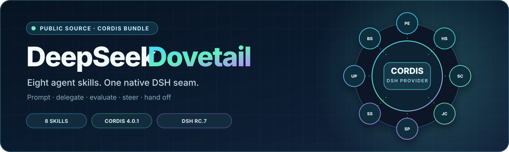
  </a>
</p>

<p align="center">
  
  
  
  
</p>

`deepseek-dovetail` brings eight [OpenCnid Dovetail](https://github.com/OpenCnid/dovetail) workflows to [DeepSeek Harness](https://github.com/deepseek-ai/deepseek-harness) as one out-of-tree Cordis bundle. DSH remains the sole agent runtime; this package mounts an immutable, package-local skill tree through DSH's published filesystem provider.

## Why use it?

- **One install, eight workflows:** prompting, skill authoring, delegation, evaluation, self-play, agent steering, and session handoff.
- **Small runtime seam:** one Cordis row and one effect-owned filesystem provider—no replacement agent loop or skill registry.
- **Quiet on load:** no network access, update check, script execution, watcher, or writes to project/user skill homes.
- **Reproducible:** upstream content is commit-pinned and hash-locked; package, integration, UI, and bounded behavioral evidence live in the repository.

## Quick start

Requirements: DeepSeek Harness `v0.1.0-rc.7`, Node.js `^22.19.0 || >=24`, and pnpm `11.x`.

```sh
git clone https://github.com/OpenCnid/deepseek-dovetail.git
cd deepseek-dovetail
corepack pnpm install --frozen-lockfile
corepack pnpm run build
corepack pnpm run verify
corepack pnpm run pack:artifact
```

Install the generated tarball into any DSH profile:

```sh
dsh plugin --profile web add {ABSOLUTE_PATH}/artifacts/deepseek-dovetail-0.1.0.tgz
dsh --profile web --dump-config
```

Replace `web` with another profile name as needed. Remove the bundle with:

```sh
dsh plugin --profile web remove deepseek-dovetail
```

In a DSH session, type `/` to browse skills or invoke one directly, for example `/prompt-engineering`. Six skills are model-discoverable; `spark-steering` and `upsum` are intentionally user-only.

## Skill gallery

Each original SVG gives the workflow a visual shorthand. Expand **Real DSH output** for an example generated through the installed bundle in the pinned DSH web profile—not a mockup. Six skills are model-discoverable and slash-invocable; `spark-steering` and `upsum` are intentionally slash-only.

<table>
  <tr>
    <td width="50%" valign="top">
      <h3><code>prompt-engineering</code></h3>
      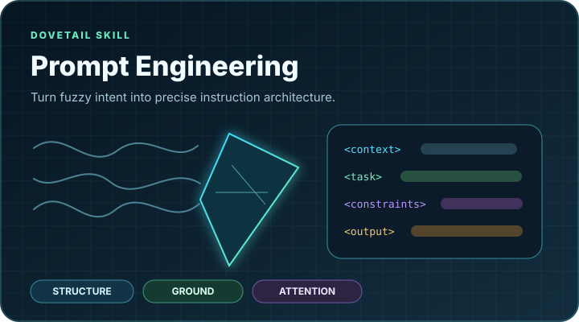
      <p>Turns a vague request into a precise instruction schema with explicit constraints and output shape. <code>/prompt-engineering</code></p>
      <details><summary><strong>Real DSH output</strong></summary>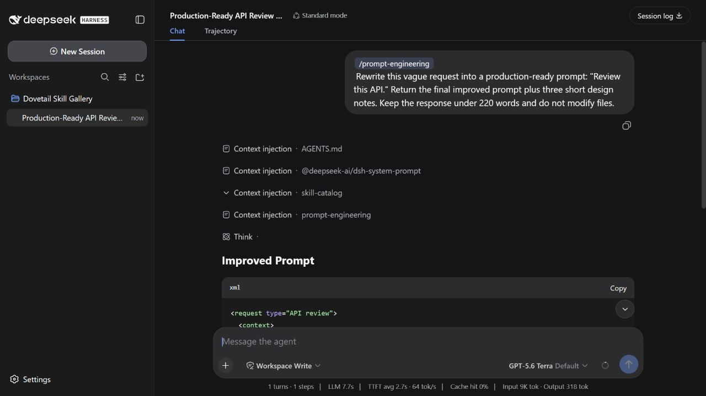</details>
    </td>
    <td width="50%" valign="top">
      <h3><code>hypershot-protocol</code></h3>
      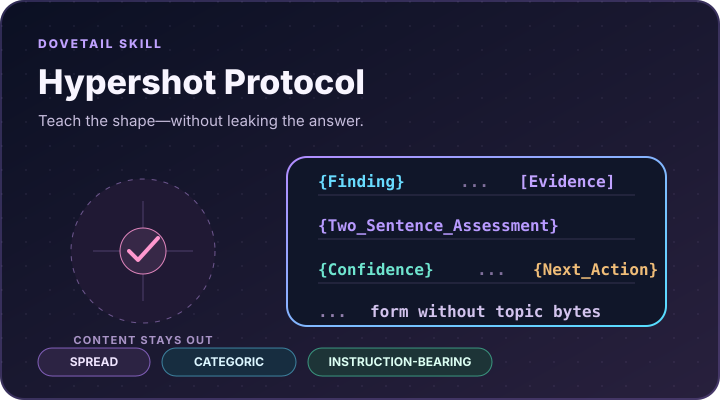
      <p>Builds examples that transfer structure without contaminating the target with task-specific content. <code>/hypershot-protocol</code></p>
      <details><summary><strong>Real DSH output</strong></summary>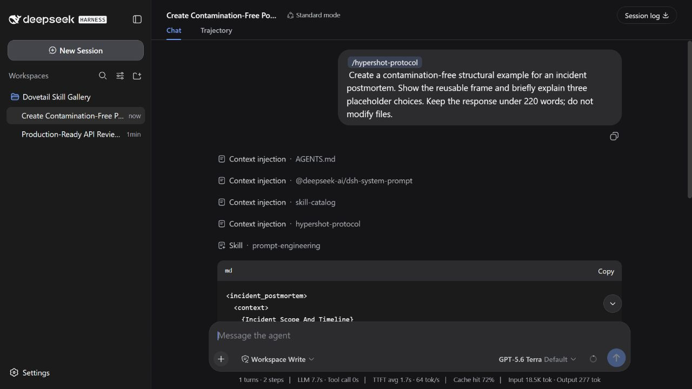</details>
    </td>
  </tr>
  <tr>
    <td width="50%" valign="top">
      <h3><code>better-skill-creator</code></h3>
      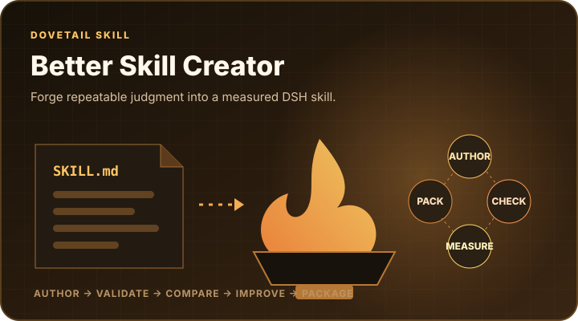
      <p>Authors compact DSH skills, validates their structure, and plans clean-baseline comparison. <code>/better-skill-creator</code></p>
      <details><summary><strong>Real DSH output</strong></summary>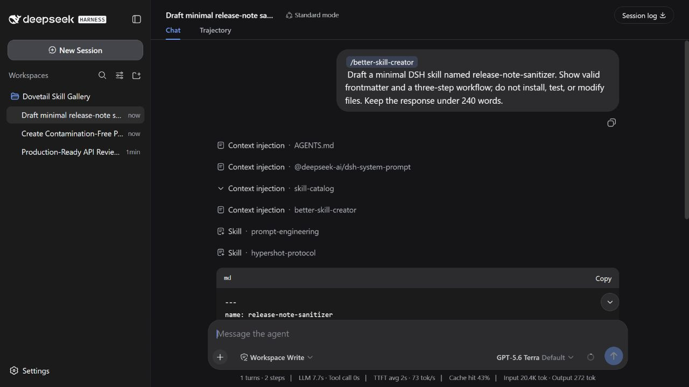</details>
    </td>
    <td width="50%" valign="top">
      <h3><code>subagent-composition</code></h3>
      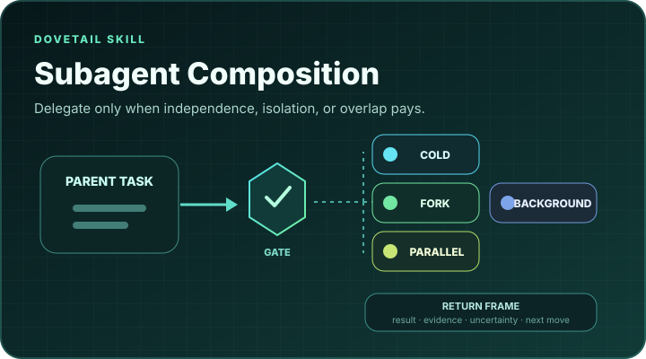
      <p>Applies a delegation gate, then chooses cold, forked, foreground, or background execution. <code>/subagent-composition</code></p>
      <details><summary><strong>Real DSH output</strong></summary>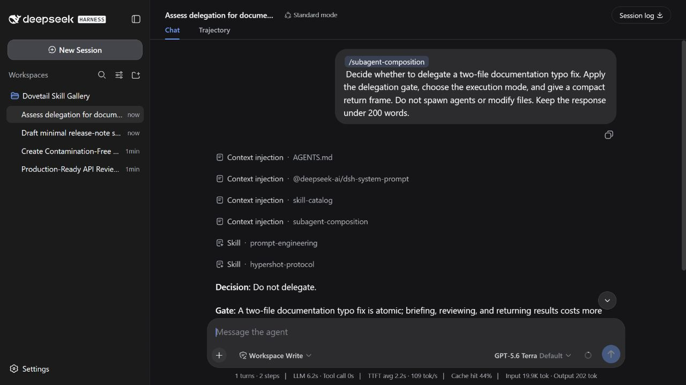</details>
    </td>
  </tr>
  <tr>
    <td width="50%" valign="top">
      <h3><code>judge-composition</code></h3>
      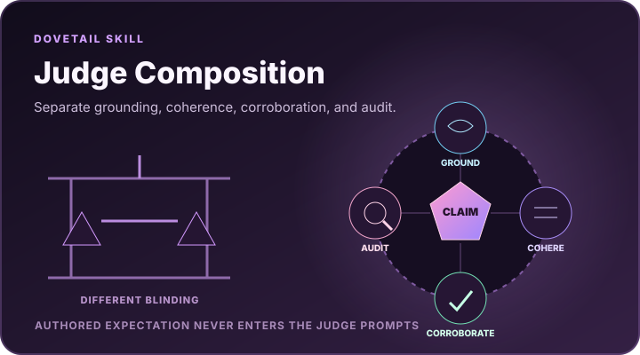
      <p>Designs separately blinded grounding, coherence, corroboration, and audit seats. <code>/judge-composition</code></p>
      <details><summary><strong>Real DSH output</strong></summary>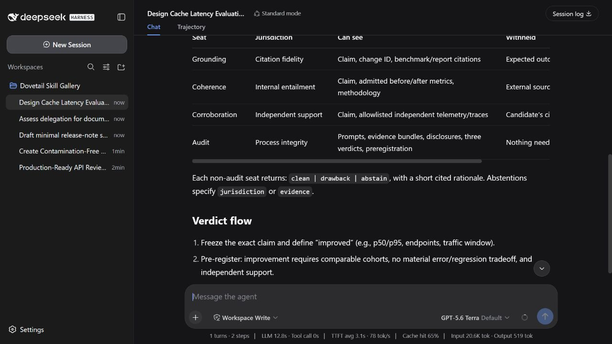</details>
    </td>
    <td width="50%" valign="top">
      <h3><code>self-play</code></h3>
      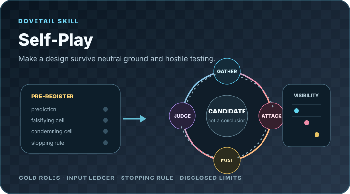
      <p>Tests unresolved designs through preregistered, visibility-controlled specialist roles. <code>/self-play</code></p>
      <details><summary><strong>Real DSH output</strong></summary>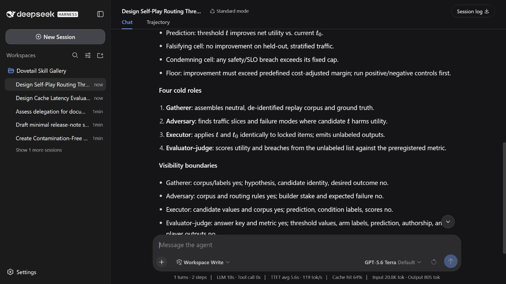</details>
    </td>
  </tr>
  <tr>
    <td width="50%" valign="top">
      <h3><code>spark-steering</code></h3>
      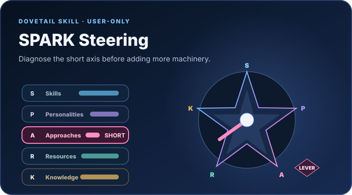
      <p>Diagnoses the shortest Skills, Personalities, Approaches, Resources, or Knowledge axis before intervention. <code>/spark-steering</code> only</p>
      <details><summary><strong>Real DSH output</strong></summary>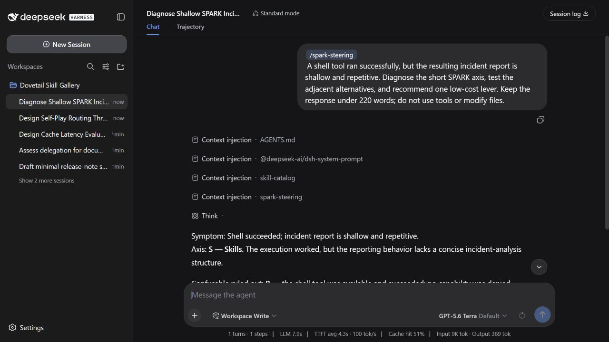</details>
    </td>
    <td width="50%" valign="top">
      <h3><code>upsum</code></h3>
      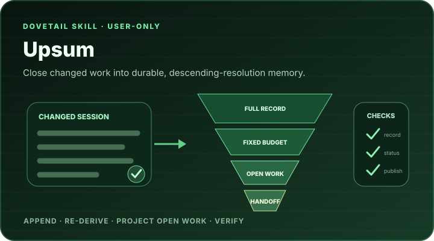
      <p>Closes changed sessions with a durable record, compressed summary, open-work projection, and checks. <code>/upsum</code> only</p>
      <details><summary><strong>Real DSH output</strong></summary>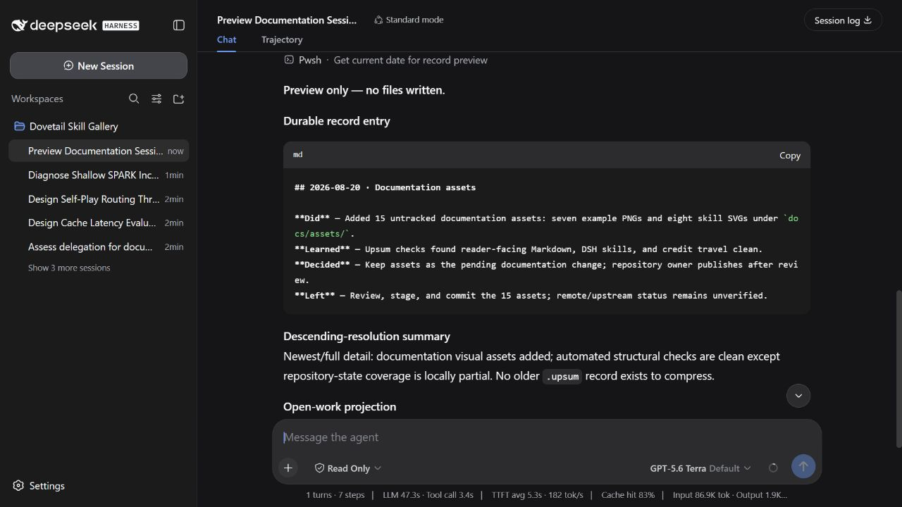</details>
    </td>
  </tr>
</table>

The captures use the assembled `deepseek-dovetail@0.1.0` profile with GPT-5.6 Terra. They are illustrative runs, not universal evaluation claims; exact prompts and capture conditions are recorded in [the example manifest](docs/assets/examples/README.md). A machine-readable [UI snapshot](evidence/assembled/web-ui.snapshot.json) covers all eight catalog entries.

## Architecture

```text
DSH profile
  -> deepseek-dovetail bundle row
  -> deepseek-dovetail Cordis plugin
  -> @deepseek-ai/dsh-skill-filesystem
  -> package-local dist/skills
  -> existing DSH catalog, agents, tools, sessions, and UI
```

The provider is named `dovetail`, excludes default roots, disables watching, and resolves its bundled directory from installed code. Project and user skill roots keep their normal precedence.

## Work on the bundle

Edit DSH adaptations in `ports/dsh/`; never hand-edit pinned `vendor/dovetail` files or generated `dist/skills` output. See [AGENTS.md](AGENTS.md) for repository rules and the complete validation workflow.

```sh
corepack pnpm run typecheck
corepack pnpm run lint
corepack pnpm run test
corepack pnpm run build
corepack pnpm run verify
corepack pnpm pack --dry-run
```

To refresh the pinned upstream subset from an exact, clean checkout:

```sh
corepack pnpm run sync:upstream -- --source {ABSOLUTE_PINNED_DOVETAIL_CHECKOUT}
```

The sync fails closed on a wrong commit, dirty source, symlink, path escape, unclassified runtime file, or manifest/hash mismatch.

## Evidence and deeper documentation

- [COMPATIBILITY.md](COMPATIBILITY.md) — pinned host contracts and the skill-by-skill port matrix.
- [evidence/REPORT.md](evidence/REPORT.md) — package, profile, UI, removal, and behavioral acceptance ledger.
- [evidence/behavioral/LIVE_REPORT.md](evidence/behavioral/LIVE_REPORT.md) — bounded real-provider comparisons and known gaps.
- [THIRD_PARTY_NOTICES.md](THIRD_PARTY_NOTICES.md) — provenance, retained licenses, notices, and code-license status.

## Public-source status and limitations

This GitHub repository is public. The npm manifest deliberately remains `private: true`, no npm package has been published, and no owner-selected public license currently covers the new adapter/build/test code. Public visibility does not imply a license grant; review [THIRD_PARTY_NOTICES.md](THIRD_PARTY_NOTICES.md) before reuse or redistribution.

Initial assembled acceptance is Windows-only. The changed/unchanged live `upsum` lifecycle remains `UNMEASURED` on the pinned Windows restricted-subprocess path, and the recorded behavioral comparisons are bounded evidence—not universal effectiveness claims.
